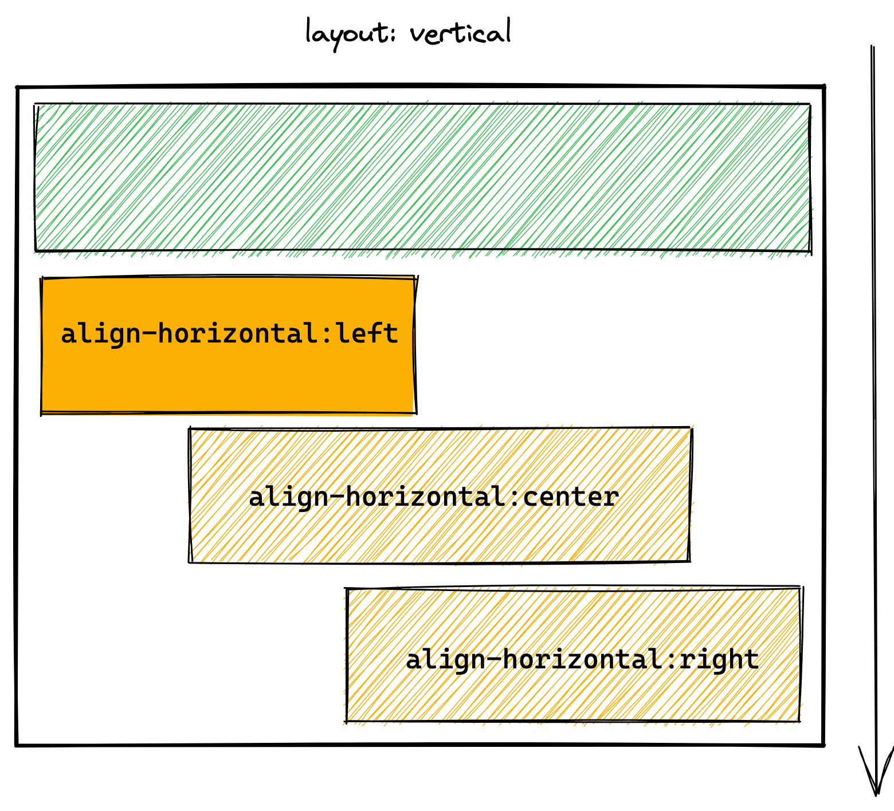

# Welcome to Textual documentation

Textual is framework for rapidly creating _text user interfaces_ (TUIs from here on) with Python.

A TUI is an application that lives within a terminal, which can have mouse and keyboard support and user interface elements like windows and panels, but is rendered purely with text. They have a number of advantages over GUI applications: they can be launched from the command line, and return to the command line, and they work over ssh.

Creating a TUI can be challenging. It may be easier to create a GUI or web application than it is to build a TUI with traditional techniques. Often projects that could use one or the other never manage to ship either.

Textual seeks to lower the difficulty level of building a TUI by borrowing developments from the web world and to a lesser extent desktop applications. The goal is for it to be as easy to develop a TUI for your project as it would be to add a command line interface.

Textual also offers a number of enhancements over traditional TUI applications by taking advantage of improvements to terminal software and the hardware it runs on. Terminals are a far cry from their roots in ancient hardware and dial-up modems, yet much of the software that runs on them hasn't kept pace.
